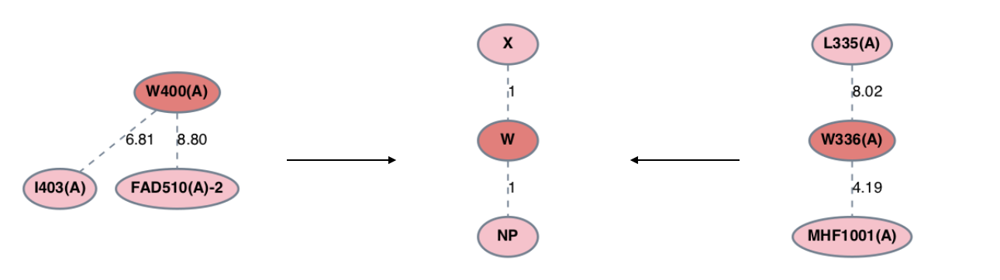
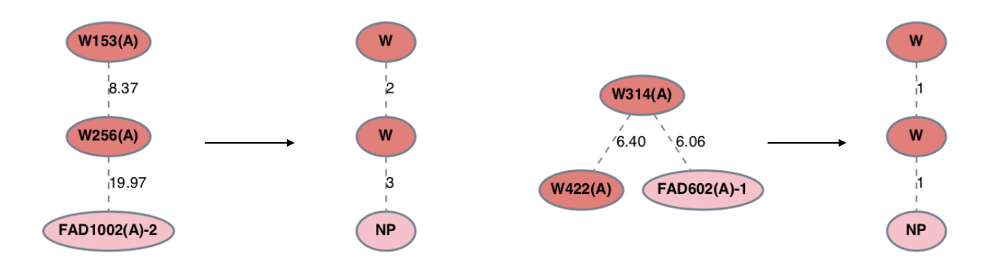

.. _classify:

Classification
=================

Introduction
-------------
The efficiency and descriptive power of graph mining is enhanced when the algorithms are 
able to distinguish between different types of nodes and edges. Graph mining in PyeMap relies 
on each node and edge in the graph database being assigned a numerical label which corresponds to its category. 
PyeMap offers some customization of these labels in order to broaden or narrow the search space.

Nodes
------

By default, each standard amino acid residue receives its own category, and all non-standard residues 
included in the analysis are labeled as 'NP' for non-protein (processed internally as '#'). One can specify a group 
of standard amino-acid residue types to be given the label 'X' (which is standard notation for unknown residue type), which enables 
these residues to be substituted for another in subgraph patterns. This is done by passing a list of 1-letter amino acid characters as 
the :py:attr:`sub` keyword argument to :func:`~pyemap.graph_mining.PDBGroup.generate_graph_database`.

**Example**

Set isoleucine and leucine to be given the label 'X' in subgraph patterns.

.. code-block:: python

    pg.generate_graph_database(sub=['I','L'])

Edges
------

By default, all edges are assigned the same numerical label of 1. One can classify edges based on their weights by passing the :py:attr:`edge_thresholds` 
argument to :func:`~pyemap.graph_mining.PDBGroup.generate_graph_database`. :py:attr:`edge_thresholds` should be formatted 
as a list of floats in ascending order, where each value indicates a cutoff threshold for an edge category. 

**Example**

.. code-block:: python

    pg.generate_graph_database(edge_thresholds=[8,12])

