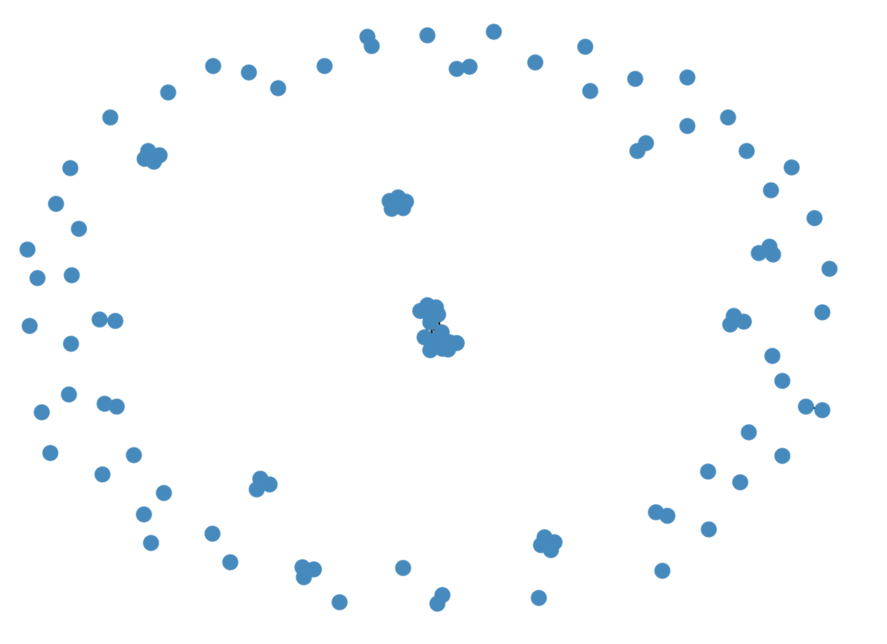
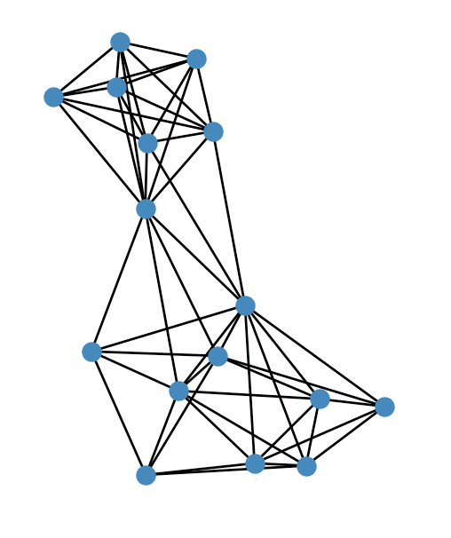

Matching and Clustering
========================

Introduction
---------------
The graph mining algorithms in the previous section tell us which PDBs a subgraph pattern is present in, 
but they do not tell us which specific residues are involved. Additionally, two subgraphs belonging to the 
same pattern can have different orientations or correspond to different residues in 
the crystal structure, and thus may not be related to one another in a meaningful way. In PyeMap, we cluster 
subgraphs based on their simiarlity in order to identify shared pathways/motifs.

Identifying Protein Subgraphs: Background
----------------------------------------------
In order to identify the specific residues involved in subgraph patterns, we utitlize the NetworkX implementation of 
the VF2 algorithm for graph matching. We refer the reader to their documentation_ for more details, but for the sake of clarity, we 
re-iterate some key defintions. 

Let G=(N,E) be a graph with a set of nodes N and set of edges E.

If G'=(N',E') is a subgraph of G, then:
    N' is a subset of N,

    E' is a subset of E

If G'=(N',E') is isomorphic to G, then:
    there exists a one-to-one mapping between N and N',

    there exists a one-to-one mapping between E and E'

If G’=(N’,E’) is a monomorphism of G, then:
    N’ is a subset of N, 
    
    E’ is a subset of the set of edges in E relating nodes in N’

In PyeMap, for each PDB which supports the given subgraph pattern, we search for all subgraph monomorphisms of the protein graph
which are isomorphic to the subgraph pattern. This gives us a set of *protein subgraphs*, which we can then cluster into 
groups based on similarity.

Clustering
------------
PyeMap currenly enables two types of clustering: **structural** similarity, and **sequence** simiarlity. 

**Basic Algorithm**

For a given subgraph pattern P, we have a set of protein subgraphs V which correspond to groups of specific residues in PDB structures 
which match pattern P. We then construct a supergraph G(V,E), where two protein subgraphs share an edge if and only if they are 
deemed sufficiently similar by the chosen metric. The resulting supergraph G will be composed of one or multiple connected components, and each 
connected component corresponds to a cluster of similar protein subgraphs.

   A supergraph composed of 66 connected components, and therefore, 66 clusters.

   The largest cluster zoomed in.

**Structural Similarity**

The structural similarity between two protein subgraphs in PyeMap is computed by superimposing the two sets of atoms 
and computing the root mean squared distance (RMSD) using the :py:class:`Bio.PDB.Superimposer` module in BioPython. 
However, atoms can sometimes be missing from crystal structures, and we would also like some flexibility to allow for substitutions. 
Starting from a one-to-one mapping between the residues, we make the following approximations to the true RMSD:

* Only the alpha carbon (CA) is considered for standard amino acid residues. If it is not present in the crystal structure, :math:`\infty` is returned.
* For non-standard amino acids, we use the first atom type both residues have in common. If no shared atom type is found, :math:`\infty` is returned.

The threshold used for determining whether two subgraphs are connected in the supergraph is 0.5 Å.

**Sequence Similarity**

Sequence simiarlity in PyeMap relies on a multiple sequence alignment, which will automatically be performed by the MUSCLE_ package [Edgar2004]_ 
if it is installed on your machine. Starting from a one-to-one mapping between the residues, 
the sequence similarity between two protein subgraphs is simply defined as the differences 
in the residue numbers with respect to the multiple sequence alignment. 
For instance, TRP50 in one PDB and TRP200 in another PDB could have a difference of 
0 if they are aligned by the multiple sequence alignment. 
One important caveat is that **non-protein residues are not considered in sequence similarity**, only standard amino acid residues. 

The threshold used for determining whether two subgraphs are connected in the supergraph is :math:`N`, where :math:`N`` is the total number 
of nodes comprising the subgraph pattern, which allows for slight misalignments.

**Note:**

If MUSCLE is not installed, the original residue numbers will be used, which is unlikely to lead to a meaningful clustering.

Source
--------

.. toctree::
   :maxdepth: 1

.. autosummary::
   :toctree: autosummary

   pyemap.graph_mining.SubgraphPattern._do_clustering
   pyemap.graph_mining.SubgraphPattern._subgraph_rmsd
   pyemap.graph_mining.SubgraphPattern._subgraph_seq_dist

.. _MUSCLE: http://www.drive5.com/muscle/

.. _documentation: https://networkx.org/documentation/stable/reference/algorithms/isomorphism.vf2.html#subgraph-isomorphism
