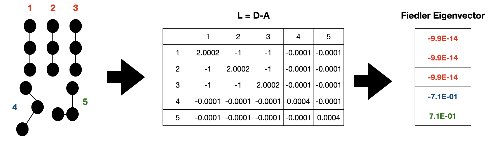

Matching and Clustering
========================

Introduction
---------------
The graph mining algorithms in the previous section tell us which PDBs a subgraph pattern is present in, 
but they do not tell us which specific residues are involved. Additionally, two subgraphs belonging to the 
same pattern can have different orientations or correspond to different residues in 
the crystal structure, and thus may not be related to one another in a meaningful way. The aim of this section 
is to describe how we identify pathways/motifs which do similar properties amongst a group of subgraphs from different PDBs
belonging to a particular subgraph pattern. 

Identifying Protein Subgraphs: Monomorphisms
----------------------------------------------
In order to identify the specific residues involved in subgraph patterns, we utitlize the NetworkX implementation of 
the VF2 algorithm for graph matching. We refer the reader to their documentation_ for more details, but for the sake of clarity, we 
re-iterate some defintions. 

Let G=(N,E) be a graph with a set of nodes N and set of edges E.

If G'=(N',E') is a subgraph of G, then:
    N' is a subset of N
    E' is a subset of E

If G'=(N',E') is isomorphic to G, then:
    there exists a one-to-one mapping between N and N'
    there exists a one-to-one mapping between E and E'

If G’=(N’,E’) is a monomorphism of G, then:
    N’ is a subset of N, E’ is a subset of the set of edges in E relating nodes in N’

In PyeMap, for each PDB which supports the given subgraph pattern, we search for all monomorphisms of the protein graph
which are isomorphic to the subgraph pattern. This gives us a set of *protein subgraphs*, which we can then cluster into 
groups based on similarity.

Clustering
------------

**Spectral Graph Partitioning**

The clustering algorithm used in PyeMap is known as `Spectral Graph Partitioning`_. For a set of :math:`N` *protein subgraphs* belonging 
to the same subgraph pattern, we construct an :math:`NxN` weighted adjacency matrix A:

.. math:: 

    A_{ij} = \begin{cases}
    0.0001 & \text{ if } d_{ij}> thresh \\ 
    1/(d_{ij}+1)& \text{ if } d_{ij} < thresh 
    \end{cases}

where the distance between two protein subgraphs :math:`d_{ij}` and the threshold are determined by the chosen similarity metric (see below). In other words, graphs with distances beyond the threshold are set to a very large distance apart from each other. 
We then construct the Laplacian L:

.. math::

    L = D -A

where :math:`D=diag(d_1,...,d_n)` is the diagonal weighted degree matrix. The partitioning comes from analyzing the components of the `Fiedler Vector`_, which corresponds to the second lowest eigenvalue of the Laplacian. Protein subgraphs which belong to the same partition are associated with identical components of the Fiedler vector, resulting in a grouping of protein subgraphs which are similar to one another. See the graphic below for an example.

   Example of Spectral Graph Partitioning for a group of subgraphs. Graphs 1,2 and 3 are partitioned into the same group, while 4 and 5 each belong to their own partition based on the components of the Fiedler eigenvector.

.. _documentation: https://networkx.org/documentation/stable/reference/algorithms/isomorphism.vf2.html#subgraph-isomorphism

.. _Spectral Graph Partitioning: https://mathworld.wolfram.com/SpectralGraphPartitioning.html

.. _Fiedler Vector: https://mathworld.wolfram.com/FiedlerVector.html

**Structural Similarity**

The structural similarity between two protein subgraphs in PyeMap is computed by superimposing the two sets of atoms 
and computing the root mean squared distance (RMSD) using the :py:class:`Bio.PDB.Superimposer` module in BioPython. However, atoms can sometimes be missing from crystal structures, and we would also like some flexibility to allow for substitutions. Starting from a one-to-one mapping between the residues, we make the following approximations to the true RMSD:

* Only the alpha carbon (CA) is considered for standard amino acid residues. If it is not present in the crystal structure, infinity is returned.
* For non-standard amino acids, we use the first atom type both residues have in common. If none is found, infinity is returned.

The threshold used for the adjacency matrix in Spectral Graph Partitoning is set to 1 Å by default.

**Sequence Similarity**

Sequence simiarlity in PyeMap relies on a multiple sequence alignment, which will automatically be performed by the MUSCLE_ package if it is installed on your machine. Starting from a one-to-one mapping between the residues, 
the sequence similarity between two protein subgraphs is simply defined as the differences 
in the residue numbers with respect to the multiple sequence alignment. 
For instance, TRP50 in one PDB and TRP200 in another PDB could have a difference of 
0 if they are aligned by the multiple sequence alignment. 
One important caveat is that **non-protein residues are not considered in sequence similarity**, only standard amino acids. 

The threshold used for the adjacency matrix in Spectral Graph Partitioning is set to N, where N is the number of nodes comprising the subgraph pattern, which allows for slight misalignments.

**Note:**

If MUSCLE is not installed, the original residue numbers will be used, which is unlikely to lead to a meaningful clustering.

.. _MUSCLE: http://www.drive5.com/muscle/

