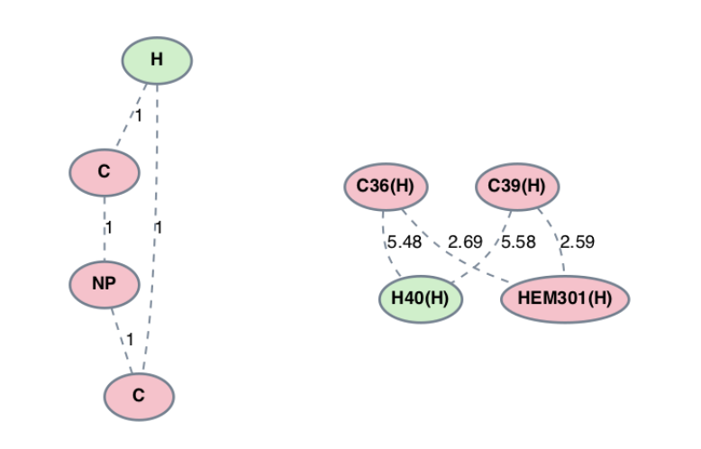

.. _mining_algo:

Mining
=======

Introduction
--------------
The goal of subgraph mining is to identify graph structures which occur a significant number of times across a set of graphs. In the context 
of PyeMap, this means searching for shared pathways/motifs amongst a set of protein crystal structures. In PyeMap, users can either search for 
all patterns which appear in a specified number of PDBs (General Pattern Mining), or search for a specified group of patterns which match 
a string representation of the graph of interest (Specific Pattern Mining). 

General Pattern Mining
------------------------
In the graph mining literature, the frequency that a pattern appears in the set of input graphs is referred to as the *support* for that 
pattern. In other words, if a pattern appears in 12/14 graphs, one would say it supports 12 graphs, or equivalently, has a support of 12 (regardless of 
whether it appears multiple times within a given graph). 

In PyeMap, we use a `Python implementation`_ of the gSpan_ algorithm [Han2002]_, one of the most efficient and popular approaches for graph mining. 
The technical details are beyond the scope of this documentation (and can be found in the gSpan_ paper), but here we emphasize a few of its key features.

* gSpan is a recursive algorithm which relies on the use of minimum depth first search (DFS) codes
* gSpan is a complete algorithm, so it will find all patterns which meet a specified support threshold
* The perfomance of gSpan is greatly sped up by increasing the minimum support threshold, as this allows more aggressive pruning of candidate subgraphs

In addition to the support number, one can also specify a minimum or maximum number of vertices for the identified subgraph patterns. For a full list 
of accepted kwargs, please refer to the gspan_mining package's repository_.

To perform general pattern mining with PyeMap, use the :func:`~pyemap.graph_mining.PDBGroup.run_gspan` function.

.. _Python Implementation: https://pypi.org/project/gspan-mining/

.. _repository: https://github.com/betterenvi/gSpan

.. _gSpan: https://sites.cs.ucsb.edu/~xyan/papers/gSpan-short.pdf

**Example**

Search for all subgraph patterns comprised of 4-6 nodes with a support number of 10 or greater using PyeMap.

.. code-block:: python

    pg.run_gspan(10,min_num_vertices=4,max_num_vertices=6)

Specific Pattern Mining
------------------------
Instead of searching for all subgraphs up to a given support threshold, one instead may be interested in finding protein 
subgraphs which match a previously known pattern. In this case, the problem is reduced to one of graph matching, and we simply 
search each PDB for a monomorphism using the NetworkX implementation of the VF2 algorithm (see the NetworkX documentation_ for more details).

.. _documentation: https://networkx.org/documentation/stable/reference/algorithms/isomorphism.vf2.html#subgraph-isomorphism

In PyeMap, this is done for protein graphs using the :py:func:`~pyemap.graph_mining.PDBGroup.find_subgraph` function.
:py:func:`~pyemap.graph_mining.PDBGroup.find_subgraph` accepts a string representation of a subgraph, 
where each character is one of the following:

* 1-character amino acid code for a standard residue
* X' for unknown amino acid types
* # for non-protein residue
* \* as a wildcard character

Branching can be specified using a syntax similar to the SMILES_ format, where there is no specification of bonding and each amino acid or special 
character described above must be separated by brackets (see example below). See the :py:func:`~pyemap.graph_mining.write_graph_smiles` function, and the  
pysmiles_ repository for more details.

If edge thresholds are used (see the classification section), the search will be performed for all possible combinations of edges, and thus 
several subgraph patterns will be found for a set of residue types. If the \* 
wildcard character is used, subgraph pattern(s) will be found for each combination of 
each residue type replacing the \* placeholder character(s), including the special X and # residue types.

**Examples**

   Examples of subgraph patterns identified using string 'WWW*'.

   Subgraph pattern (left) and protein subgraph (right) identified using the string '[H]1[C][#][C]1'.

Subgraph Patterns
------------------

The end result of either mining option is a set of *subgraph patterns*, each of which has a unique ID with the format:

{Index}_{String representation}_{support number}

e.g. 1_WWW_18.

The string representation for each pattern is a pseudo-SMILES string generated using 
the pysmiles_ package. Importantly, these strings can be used as inputs for 
:py:func:`~pyemap.graph_mining.PDBGroup.find_subgraph`, as they correctly encode the structure of the graph using a syntax
similar to the \href{http://opensmiles.org/opensmiles.html}{SMILES} format.

Source
-------

.. toctree::
   :maxdepth: 1

.. autosummary::
   :toctree: autosummary

   pyemap.graph_mining.write_graph_smiles

.. _SMILES: http://opensmiles.org/opensmiles.html
.. _pysmiles: https://github.com/pckroon/pysmiles