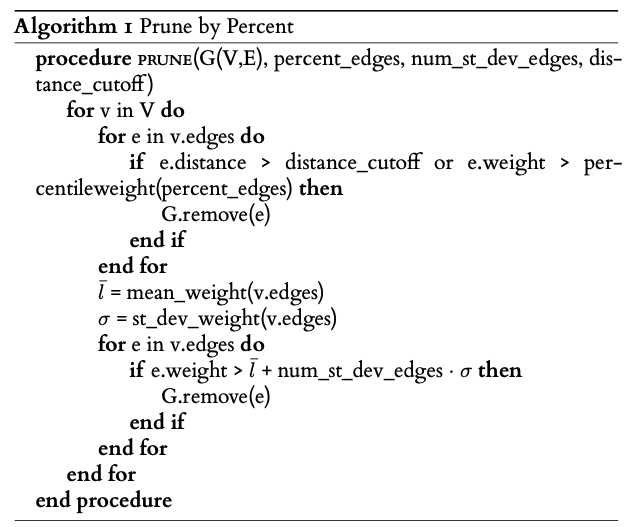

Graph construction
=========================================================

Introduction
-------------
The first step to constructing the graph theory model is constructing a pairwise distance matrix for the selected amino acid residues.
The distance is calculated either between centers of mass of the side chains, or between their
closest atoms. For standard protein residues, only side chain atoms
are considered in the calculation. All atoms of automatically identified
non-protein ET active moieties and user-specified custom fragments
are considered in the distance calculations. From the distance matrix,
an undirected weighted graph is constructed using NetworkX_, with
the calculated distances as weights. 

One of two algorithms are then used to prune the edges of the graph, which is specified by the :attr:`edge_prune` keyword argument
to :func:`~pyemap.process_data.process`.

**Percent-based algorithm (default)**

This algorithm considers only the smallest :attr:`percent_edges` % of edges by weight per node, and then prunes based on the mean and standard deviation 
of the weights of the remaining edges.

..
 .. _percent_prune:
 .. pcode::

    \begin{algorithm}
    \caption{Prune by Percent}
    \begin{algorithmic}
    \PROCEDURE{prune}{G(V,E), percent\_edges, num\_st\_dev\_edges, distance\_cutoff}  
        \FOR{v in V}
            \FOR {e in v.edges}
            \IF{e['weight'] > distance\_cutoff or e['weight'] > percentileweight(percent\_edges)}
               \STATE G.remove(e)
            \ENDIF
            \ENDFOR
            \STATE $\bar{l}$ = mean\_weight(v.edges)
            \STATE $\sigma$ = st\_dev\_weight(v.edges)
            \FOR {e in v.edges}
            \IF{e['weight'] > $\bar{l}$ + num\_st\_dev\_edges $\cdot$  $\sigma$}
               \STATE G.remove(e)
            \ENDIF
            \ENDFOR
        \ENDFOR
    \ENDPROCEDURE
    \end{algorithmic}
    \end{algorithm}

..

:attr:`percent_edges`, :attr:`num_st_dev_edges`, and :attr:`distance_cutoff` are specified as keyword arguments to 
:func:`~pyemap.process_data.process`. 

Specify :attr:`edge_prune='PERCENT'` to use this algorithm.

**Degree-based algorithm**

This algorithm greedily prunes the largest edges by weight of the graph until each node has at most :attr:`edge_prune` neighbors.

..
   .. _degree_prune:
   .. pcode::

    \begin{algorithm}
    \caption{Prune by Degree}
    \begin{algorithmic}
    \PROCEDURE{prune}{G(V,E), max\_degree, distance\_cutoff}  
        \STATE removal\_candidates = []
        \FOR{e in E}
            \IF{e['weight'] > distance\_cutoff}
               \STATE G.remove(e)
            \ENDIF
            \ENDFOR
        \FOR{v in V}
            \IF{degree(v) > D}
               \STATE removal\_candidates.append(v.edges)
            \ENDIF
        \ENDFOR
        \STATE sort\_by\_weight\_descending(removal\_candidates)
        \FOR{e(u,v) in removal\_candidates}
            \IF {degree(u) > max\_degree or degree(v) > max\_degree}
               \STATE G.remove(e)
            \ENDIF
         \ENDFOR
    \ENDPROCEDURE
    \end{algorithmic}
    \end{algorithm}
..

:attr:`max_degree` and attr:`distance_cutoff`: are specified as keywords arguments to :func:`~pyemap.process_data.process`.

Specify :attr:`edge_prune='DEGREE'` to use this algorithm. This algorithm is recommended when doing :ref:`Protein Graph Mining <pgm>`.

**Penalty Functions**

After the edges are pruned, the weights are recast as modified distance dependent penalty functions:

.. math::
   P'=-log_{10}(\epsilon)

where: 

.. math::
   \epsilon = \alpha \exp(-\beta(R-R_{offset}))

α, β, and :math:`R_{offset}` are hopping parameters, similar to the through-space
tunneling penalty function in the Pathways model [Beratan1992]_. All subsequent
calculations are performed using the modified penalty functions as
edge weights. When using default hopping parameters (α = 1.0,
β = 2.3, Roffset = 0.0), the edge weights will be equal to the distances
(multiplied by a prefactor of :math:`2.3*log_{10}(e)` ≈ 1).

Distance thresholds and penalty function parameters can be modified at the process step. 

Visualization and further analysis
-----------------------------------
The graph can be interacted with and written to file using the :class:`~pyemap.emap` object. The graph is visualized using PyGraphviz_ and 
Graphviz_. The graph is stored as a :class:`networkx.Graph` object in the :attr:`init_graph` and :attr:`paths_graph` attributes of the :class:`~pyemap.emap` object.

.. _PyGraphviz: https://pygraphviz.github.io/
.. _Graphviz: http://www.graphviz.org/
.. _NetworkX: https://networkx.github.io/

	>>> G = my_emap.init_graph
	>>> print(G.edges[('W17(A)', 'W45(A)')]['distance'])
	>>> 12.783579099370808

Source
-------

.. autosummary::
   :toctree: autosummary

   pyemap.process_data.filter_by_degree
   pyemap.process_data.filter_by_percent
   pyemap.process_data.create_graph
   pyemap.process_data.pathways_model