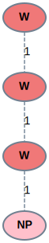
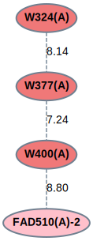
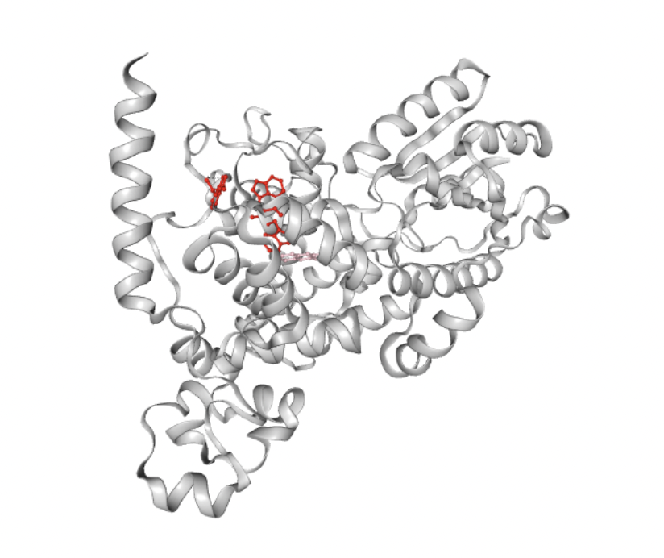

==============================
Tutorial: Protein Graph Mining
==============================
This tutorial can help you start working with the :attr:`pyemap.graph_mining` module 
of PyeMap.

Parsing
=========
The first step of graph mining with PyeMap is to create a :class:`~pyemap.graph_mining.PDBGroup` object, 
and populate it with :class:`~pyemap.emap` objects for the PDBs of interest. 
Here, we'll fetch and parse a small set of flavoprotein PDBs.

.. code-block:: python

   import pyemap 
   from pyemap.graph_mining import PDBGroup 
   pdb_ids = ['1X0P', '1DNP', '1EFP', '1G28', '1IQR', '1IQU', 
   '1NP7', '1O96', '1O97', '1QNF', '1U3C', '1U3D', '2IYG', '2J4D', 
   '2WB2', '2Z6C', '3FY4', '3ZXS', '4EER', '4GU5', '4I6G', '4U63', 
   '6FN2', '6KII', '6LZ3', '6PU0', '6RKF'] 
   pg = PDBGroup('My Group') 
   for pdb in pdb_ids: 
      pg.add_emap(pyemap.fetch_and_parse(pdb)) 

Generating Protein Graphs
==========================
The next step is to generate the graphs for each PDB. 
One can specify the chains, ET active moieties, residues, 
and any other kwargs from :func:`~pyemap.process`. If no arguments 
are specified, the first chain from each PDB will be chosen, and all ET active moieties on those chains will be included. See :func:`~pyemap.graph_mining.PDBGroup.process_emaps` for more details.

.. code-block:: python

   pg.process_emaps()

Generate graph database
========================
The next step is to classify the nodes and edges. One can define "substitutions" for nodes, and thresholds for edges.
See :func:`~pyemap.graph_mining.PDBGroup.generate_graph_database` for more details.

.. code-block:: python

   # W and Y would be interchangeable and given the label 'X'
   substitutions = ['W','Y']
   # edges with weights > 12 are distinguished from those with weights < 12
   edge_thresholds = [12] 
   pg.generate_graph_database(sub=[],edge_thresh=edge_thresholds) 

Mine for subgraphs
===================
There are two types of searches available in PyeMap. 

1.  mine for all possible subgraphs:

.. code-block:: python

   pg.run_gspan(19)

2. search for a specific pattern:

.. code-block:: python

   pg.find_subgraph('WWW#')

Analysis: Subgraph patterns
=============================
The identified subgraphs are stored in the `subgraph_patterns` dictionary.

   >>> pg.subgraph_patterns
   {'1_WWW#_18': <pyemap.graph_mining.frequent_subgraph.SubgraphPattern at 0x10d652430>,
   '2_WWW#_14': <pyemap.graph_mining.frequent_subgraph.SubgraphPattern at 0x183c3a1f0>,
   '3_WWW#_4': <pyemap.graph_mining.frequent_subgraph.SubgraphPattern at 0x183c3aca0>,
   '4_WWW#_2': <pyemap.graph_mining.frequent_subgraph.SubgraphPattern at 0x183c2de50>,
   '5_WWW#_2': <pyemap.graph_mining.frequent_subgraph.SubgraphPattern at 0x183c24a30>,
   '6_WWW#_2': <pyemap.graph_mining.frequent_subgraph.SubgraphPattern at 0x183c24730>,
   '7_WWW#_1': <pyemap.graph_mining.frequent_subgraph.SubgraphPattern at 0x12c680f10>}

The subgraph pattern can be visualized using :func:`pyemap.graph_mining.SubgraphPattern.subgraph_to_Image` or 
:func:`pyemap.graph_mining.SubgraphPattern.subgraph_to_file`.

.. code-block:: python

   sg = pg.subgraph_patterns['1_WWW#_18']
   sg.subgraph_to_Image()

Analysis: Protein subgraphs
============================

To identify the specific residues in each PDB involved in the identified patterns, 
one should first call :func:`pyemap.graph_mining.SubgraphPattern.find_protein_subgraphs`. The 
identified **protein subgraphs** are stored in the `protein_subgraphs` dictionary. Each protein subgraph 
has a unique ID.

.. code-block:: python

   sg.find_protein_subgraphs()
   sg.protein_subgraphs
   {'4U63_1': <networkx.classes.graph.Graph at 0x183d58fa0>,
   '4U63_2': <networkx.classes.graph.Graph at 0x183b66be0>,
   '4U63_3': <networkx.classes.graph.Graph at 0x183cf7040>,
   '4U63_4': <networkx.classes.graph.Graph at 0x183d53eb0>,
   '4U63_5': <networkx.classes.graph.Graph at 0x183d51220> ...

To visualize a protein subgraph, use :func:`pyemap.graph_mining.SubgraphPattern.subgraph_to_Image` or 
:func:`pyemap.graph_mining.SubgraphPattern.subgraph_to_file` and pass the ID as a keyword argument.

.. code-block:: python

   sg.subgraph_to_Image('1U3D_51')

Clustering
============
Protein subgraphs are clustered into groups based on sequence or structural similarity. 
By default, structural clustering is used. To switch to sequence clustering, call :func:`pyemap.graph_mining.SubgraphPattern.set_clustering`.

.. code-block:: python

   print(sg.groups)
   {1: ['4U63_33', '1DNP_34', '2J4D_40', '1IQR_43', '1IQU_47'], ...
   44: ['3ZXS_60'] ... }

Visualize in NGLView
=======================
Protein subgraphs can be visualized in the crystal structure using the `NGLView Jupyter Widget <http://nglviewer.org/nglview/latest/api.html>`_. 
Pass the pathway ID of interest along with a :class:`nglview.widget.NGLWidget` object to 
the :func:`~pyemap.graph_mining.SubgraphPattern.visualize_subgraph_in_nglview` function.

.. code-block:: python

   import nglview as nv
   view = nv.show_file(sg.support['1U3D'].file_path)
   view.clear_representations()
   view.add_cartoon(color="lightgray")
   sg.visualize_subgraph_in_nglview('1U3D_50',view)
   view

