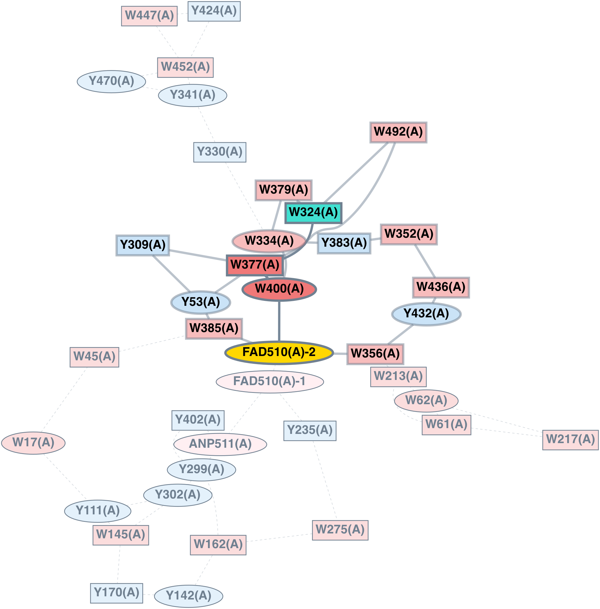

==============================
Tutorial
==============================
This tutorial can help you start working with PyeMap.

Basic Usage
===========

Parsing
-------
The first step of PyeMap analysis is parsing of a .cif or pdb file.

You can either provide PyeMap with the path to the file:

   >>> import pyemap
   >>> my_emap = pyemap.parse("path/to/protein.pdb")

Or fetch from the RCSB database by 4 character PDB ID:

   >>> my_emap = pyemap.fetch_and_parse("1u3d")
   Fetching file 1u3d from RSCB Database...
   Success!
   Identified 3 non-protein ET active moieties.

This generates an :class:`~pyemap.emap` object; a dynamic data structure which manages the data at all phases of pyemap analysis.
At this stage, the :class:`~pyemap.emap` object contains the parsed protein structure, and a list of automatically identified non-protein electron 
transfer active moieties. 

Process
-------
Next, construct the graph model of the protein crystal structure using :func:`~pyemap.process_data.process`

   >>> pyemap.process(my_emap)
   >>> my_emap.init_graph_to_Image().show()

   
Surface exposed residues appear as rectangular nodes, while buried residues appear as oval nodes. Edge weights are proportional 
to distances between residues. By default, all Trp, Tyr, and automatically detected non-protein electron transfer 
active moieties are included.

There are various parameters one can specify to control which residues are included in the graph, and the overall connectivity of the graph.
For example, to include phenylalanine residues, and to modify the pure distance filter for edges, do:

   >>> pyemap.process(my_emap,phe=True,distance_cutoff=15)
   >>> my_emap.init_graph_to_Image().show()

.. image:: images/phe.png

Find Pathways
--------------
Finally, search for possible pathways from a specified electron/hole donor to the surface using :func:`~pyemap.pathway_analysis.find_paths`:

   >>> pyemap.find_paths(my_emap,"FAD510(A)-2")
   >>> my_emap.paths_graph_to_Image().show()

Alternatively, you can search for pathways from a specified donor to a particular acceptor:

   >>> pyemap.find_paths(my_emap,"FAD510(A)-2", target = "W324(A)", max_paths=10)
   >>> my_emap.paths_graph_to_Image().show()

To get a report of the pathways found by pyemap, use :func:`~pyemap.emap.report`

   >>> print(my_emap.report())
   Branch: W324(A)
   1a: ['FAD510(A)-2', 'W400(A)', 'W377(A)', 'W324(A)'] 24.15
   1b: ['FAD510(A)-2', 'W385(A)', 'Y53(A)', 'W377(A)', 'W324(A)'] 35.25
   1c: ['FAD510(A)-2', 'W400(A)', 'W334(A)', 'W379(A)', 'W324(A)'] 36.37
   1d: ['FAD510(A)-2', 'W400(A)', 'W377(A)', 'W492(A)', 'W324(A)'] 49.20
   1e: ['FAD510(A)-2', 'W385(A)', 'Y53(A)', 'Y309(A)', 'W377(A)', 'W324(A)'] 50.67
   1f: ['FAD510(A)-2', 'W385(A)', 'Y53(A)', 'W377(A)', 'W492(A)', 'W324(A)'] 60.30
   1g: ['FAD510(A)-2', 'W385(A)', 'Y53(A)', 'W377(A)', 'W400(A)', 'W334(A)', 'W379(A)', 'W324(A)'] 61.93
   1h: ['FAD510(A)-2', 'W356(A)', 'Y432(A)', 'W436(A)', 'W352(A)', 'Y383(A)', 'W334(A)', 'W379(A)', 'W324(A)'] 72.20
   1i: ['FAD510(A)-2', 'W385(A)', 'Y53(A)', 'Y309(A)', 'W377(A)', 'W492(A)', 'W324(A)'] 75.72
   1j: ['FAD510(A)-2', 'W385(A)', 'Y53(A)', 'Y309(A)', 'W377(A)', 'W400(A)', 'W334(A)', 'W379(A)', 'W324(A)'] 77.35

Interacting with the emap object
=================================
The :class:`~pyemap.emap` object manages all of the data at every stage of the analysis, and this data is accessible through its 
attributes and functions. 

Dictionaries
-------------
Much of the data on residues is stored in various dictionaries, where the key is residue name as it appears in the graph image. For example,
to directly access the Biopython :class:`~Bio.PDB.Residue.Residue` object corresponding to the node W324(A) do:

   >>> residue_obj = my_emap.residues["W324(A)"]
   >>> print(type(residue_obj))
   <class 'Bio.PDB.Residue.Residue'>

The same is true of pathways, which are stored as :class:`~pyemap.ShortestPath` objects. Any pathway(and by extension its attributes) can be accessed by its pathway ID. For example, if you want
the selection string for visualization of pathway 1a in the NGL_ viewer, do:

   >>> my_path = my_emap.paths["1a"]
   >>> print(my_path.selection_strs)
   '(510 and :A and .N1) or (510 and :A and .C2) or (510 and :A and .O2) or (510 and :A and .N3) or 
   (510 and :A and .C4) or (510 and :A and .O4) or (510 and :A and .C4X) or (510 and :A and .N5) or 
   (510 and :A and .C5X) or (510 and :A and .C6) or (510 and :A and .C7) or (510 and :A and .C8) or 
   (510 and :A and .C9) or (510 and :A and .C9A) or (510 and :A and .N10) or (510 and :A and .C10)', 
   '(400 and :A and .CG) or (400 and :A and .CD1) or (400 and :A and .CD2) or (400 and :A and .NE1) or 
   (400 and :A and .CE2) or (400 and :A and .CE3) or (400 and :A and .CZ2) or (400 and :A and .CZ3) or 
   (400 and :A and .CH2)', '(377 and :A and .CG) or (377 and :A and .CD1) or (377 and :A and .CD2) or 
   (377 and :A and .NE1) or (377 and :A and .CE2) or (377 and :A and .CE3) or (377 and :A and .CZ2) or 
   (377 and :A and .CZ3) or (377 and :A and .CH2)', '(324 and :A and .CG) or (324 and :A and .CD1) or 
   (324 and :A and .CD2) or (324 and :A and .NE1) or (324 and :A and .CE2) or (324 and :A and .CE3) or 
   (324 and :A and .CZ2) or (324 and :A and .CZ3) or (324 and :A and .CH2)'

.. _NGL: http://nglviewer.org/ngl/api/

Graphs
------
The graphs are stored in the :class:`~pyemap.emap` object as NetworkX :class:`~networkx.Graph` objects. The attributes of edges and vertices can be accessed
from these graphs in usual NetworkX fashion (see their documentation for more information). For example, to access the weight of the
edge connecting vertices FAD510(A)-2 and W400(A), do:

   >>> weight = my_emap.init_graph["FAD510(A)-2"]["W400(A)"]['weight']
   >>> print(weight)
   8.793106029091886

If what you need instead is the actual distance, this information is also kept:

   >>> dist = my_emap.init_graph["FAD510(A)-2"]["W400(A)"]['distance']
   >>> print(dist)
   8.802989071175238

Visualization
-------------
Graph images and chemical structures of non-protein electron transfer active moieties can be exported to PIL with the 
:func:`~pyemap.emap.residue_to_Image()`, :func:`~pyemap.emap.init_graph_to_Image()`, :func:`~pyemap.emap.paths_graph_to_Image()` functions. To save
to file, use :func:`~pyemap.emap.paths_graph_to_file()`, :func:`~pyemap.emap.init_graph_to_file()`, and :func:`~pyemap.emap.residue_to_file`. 

   >>> my_emap.residue_to_Image("FAD510(A)-2").show()

.. image:: images/fad.png

